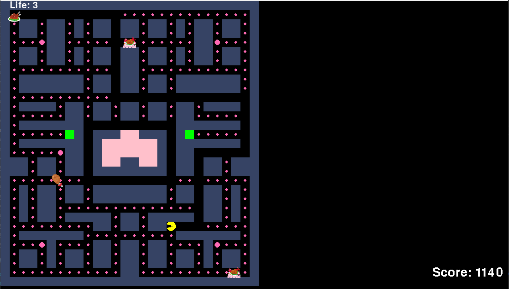

# Pacman

## 実行環境の必要条件
* python >= 3.10
* pygame >= 2.1

## ゲームの概要
* pygameでPacmanを再現する

## ゲームの遊び方
* ゲーム画面
    * 
   
### 操作方法
- ENTERキーを押しゲームを開始する。
- 矢印キーで"EASY", "NORMAL", "HARD"からマップを選び、ENTERキーを押す。
- 矢印キー（上下左右）でプレイヤーを移動できます。一度入力すると、その方向が保持される。
- 通路（パス）になっているマスしか移動できません。
- 壁になっている場所には進めません。
- エサ（通常エサ・パワーエサ）

- マップ内には「通常エサ(小さいピンクのドット)」と「パワーエサ(大きいピンクのドット)」があります。
プレイヤーがエサを食べるとスコアが加算されます。
- パワーエサを食べると一定時間だけ敵（ゴースト）を食べられるようになります（ゴーストが“弱体化モード”に入る）。

### 敵（ゴースト）
- プレイヤーを追いかけたり、マップの端で縄張りを巡回したりするなど、複数のモードで動き回ります。
通常時にゴーストに接触するとプレイヤーはやられてしまい、ゲームオーバーの原因となります。
- パワーエサを取ってゴーストが「弱体化モード」の間は、接触するとゴーストが食べられる状態になります。
- 食べられたゴーストはスタート位置へ戻り、しばらくしてから復活する。

### ワープトンネル
- マップの一部にある「ワープトンネル(緑色マス)」に入ると、マップの別のトンネル位置へ瞬間移動できます。
- ただし、連続してワープはできず、いったんトンネルから出たあとで再度トンネルに入る必要があります。

### ゲームオーバー条件
- プレイヤーが敵（ゴースト）に通常状態で触れるとゲームオーバーになります。
- ゲームオーバー時は専用の画面が表示されて終了する。

## ゲームの実装
### マップの描画 担当: 村山奏人
`Map`クラスは、Pacmanゲームのマップを管理する役割を担っています。ゲーム内の通路、壁、アイテム、敵の位置などを保持し、それに関連する機能を実装している。

### 主要なメンバー変数

- **`map_data`**  
  ゲームのマップデータを2次元リストとして保持する。数値は、通路や壁、アイテム、敵の位置などを示す。
- **`height` と `width`**  
  マップの高さと幅を表す。
- **`power_pellets`**  
  パワーエサ（ゲーム中で特別な効果を持つエサ）の位置リスト。
- **`tunnels`**  
  ワープトンネルの位置リスト。
- **`playfield`**  
  ゲームプレイエリアの構造を表現する2次元リスト。通路やアイテム、ワープトンネルの位置情報が格納される。
- **`enemy_start_positions`**  
  敵キャラクターの初期位置リスト。
- **`dots_remaining`**  
  ゲーム内で残っている通常エサの数。
- **`dots_eaten`**  
  食べられたエサの数。

### 主なメソッド

#### 1. `__init__(self, map_file: str) -> None`
指定されたテキストファイル（`map_file`）からマップデータを読み込む。ファイル内の数値をもとに、通路、壁、エサ、パワーエサ、ワープトンネル、そして敵の初期位置を特定し、それらをインスタンス変数に保存する。

### 2. `draw(self, screen: pg.Surface, field_start: tuple[int, int]) -> None`
指定された画面にマップを描画する。`map_data`内の各セルの値に応じて色を設定し、壁や通路、ワープトンネルなどを描画する。

### マップのセルについて

マップデータは、ゲーム内のセルを示す2次元リストとして保持される。セルには次のような値が使われる：

- `0`: 通路  
- `1`: 壁  
- `2`: 通常エサ  
- `3`: パワーエサ  
- `4`: ゴーストの家の入り口  
- `5`: ワープトンネル  

### 交差点の判定
`playfield`のセルごとに、交差点かどうかを判定する。交差点は、上・下・左・右のいずれかの方向に通路が3方向以上あるセル。この情報は、プレイヤーや敵がその場所を通過する際の判断基準となる。

### 役割と利用方法

- **描画**  
  `draw()`メソッドを使用して、ゲーム内にマップを描画する。
- **情報提供**  
  プレイヤーや敵キャラクターが移動する際に通行可能な場所や交差点の情報を提供する。
- **初期化**  
  マップデータを読み込んでアイテムや敵の初期位置を管理する。

`Map`クラスは、ゲームの基盤となるマップ管理を担い、プレイヤーや敵の動作に必要な情報を提供する。

### 主人公キャラクターの描画
* Playerクラス
* 概要: 主人公キャラクター（パックマン）の操作と動作を管理するクラス。
* 初期化:
* 初期位置（グリッド座標）を設定。
* 初期残機は3。
* 描画:
* プレイヤーを黄色い円で描画。
* 現在の残機数を画面左上に表示。
* 移動:
* 矢印キーで移動。
* 壁やマップ境界線に当たると移動できない。
* ワープトンネルを通過可能。
* 回転:
* 移動方向に応じて画像を回転。
* 右方向: 0度、左方向: 180度、上方向: 270度、下方向: 90度。
* アニメーション:
* 移動中にアニメーション（口が開閉する動き）を表示。
* 当たり判定:
* エサを食べるとスコアが増加。
* 敵に当たると残機が1減り、初期位置にリセットされる。
* 残機が0になるとゲームオーバー。
* 主なメソッド:
* handle_input(keys): 矢印キーの入力を受け取り、移動方向を決定。
* update(): 現在の位置や移動状態を更新。
* draw(screen): プレイヤーを画面に描画。
* reset_position(): プレイヤーの位置を初期位置にリセット。
* is_valid_move(grid_pos): 指定されたグリッド位置が移動可能かを判定。
* get_grid_pos(): 現在のグリッド座標を取得。
* update_rotation(direction): 移動方向に応じて画像を回転。
* 

### 敵の描画 担当: 森山悠太
**`Enemy`クラス:**
- 敵キャラクターの管理。
- 追跡、縄張り、弱体化モード。
- **各敵の行動パターン:**
    - **Enemy ID 1:** プレイヤーを追跡。
    - **Enemy ID 2:** プレイヤーの数ステップ先を予測して追跡。
    - **Enemy ID 3:** 他の敵とプレイヤーの位置関係を見て挟み撃ち。
    - **Enemy ID 4:** 近いとランダム移動、遠いと追跡。
- `update`で行動決定、移動、モード切替。
- `find_path`でA\*アルゴリズムによる経路探索。
- `move`で経路移動。
- `make_weak`で弱体化モードへ移行。
- `get_eaten`で食べられた状態へ移行。
- `revive`で復活処理。

### アイテムの設定 担当：𠮷岡
**`Item`クラス**
#### 概要
Itemクラスは、ゲーム内に配置されるエサを表示するためにクラス 。このクラスはpygame.sprite.Spriteクラスを継承しており、PygameのSprite機能を活用して、アイテムの当たり判定を効率的に行えるようにしている

#### 属性
* image (pygame.Surface) : コインの描画を使用されるSurfaceオブジェクトが描画される
* grid_pos (tuple) : グリッド座標のタプル
* item_type (ini) : アイテムの種類 (1: 通常エサ, 2: パワーエサ)

#### メソッド
- __init__ (self, x: int, y: int) :
    - Itemクラスのコンストラクタ
    - 引数としてコインが配置されるマップ上の座標を受け取る
    - コンストラクタ内で、コインの半径、描画する円、位置が設定される

- update (self, player:'Player') :
    - アイテムを更新する
    - プレーヤーと衝突したらkill

### スコアの表示　担当：𠮷岡
**`Score`クラス**
#### 概要
Scoreクラスは、ゲーム中のスコアを管理し、画面に表示するためのクラス。スコア値の保持、表示テキストの生成および画面への描画

#### 属性
* font (pygame.font.Font) : スコア表示に使用するフォントオブジェクト
* color (tuple) : スコア表示テキストの色を表すRGBタプル
* value (int) : 現在のスコア値を保持
* image = (pygame.Surface) : スコア値を描画したSurfaceオブジェクト
* rect (pygame.Rect) : スコア表示テキストの位置とサイズを保持するRectオブジェクト

#### メソッド 
- __init__ (self) :
    - Scoreクラスのコンストラクタ
    - コンストラクタ内で、フォント、色、初期スコア値、初期スコア表示テキスト、位置を設定
- update(self, screen : pygame.Surface) : 
    - スコア値を更新し、更新されたスコアテキストを画面に描画
    - screen引数は、スコアを表示するpygameのSurfaceオブジェクト

### スタート画面の描画 担当: 春田康生 
* PacmanGameのスタート画面を描画する
* スペースキーでゲームを開始

### ゲームオーバー画面の描画 担当: 春田康生
* ライフが３つ減ったときにGAMEOVERと表示

### DebugInfo クラス 担当: 森山悠太
- プレイヤー情報の表示
- 敵の情報の表示と経路の描画
- アイテム情報の表示

### ToDo
- 残機の追加
- スコア表示
- GameOver画面の追加
- マップの修正
- enemyの向き

### メモ
* 
